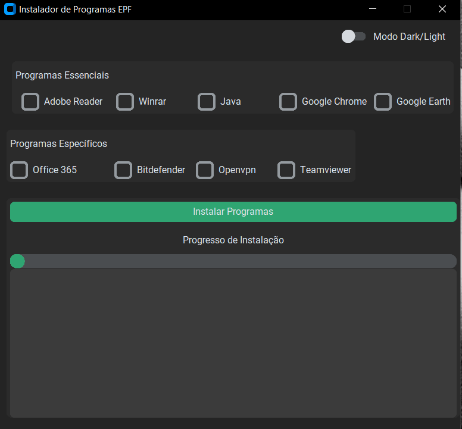
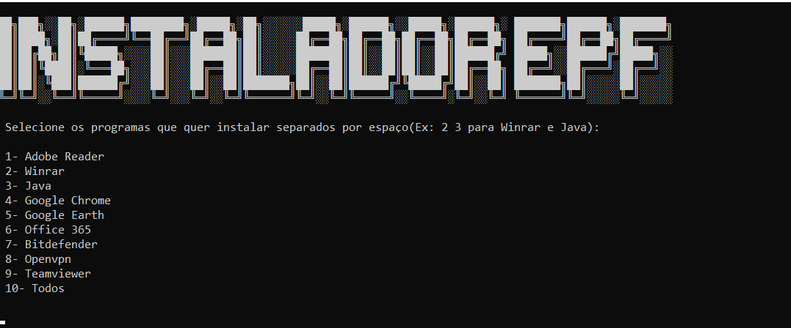

Python Program to Install Essential Programs with Winget to Windows and "Specific" Programs with Threads

**Technologies used:**

- CustomTkinter for the UI;
- MS GRAPH API to Onedrive download files;
- Pool Threading in Python with concurrent.futures

Obs.Some Softwares like Office 365, BitDefender, Teamviewer Host needs special atention because needs user configuration with UI features, so it's complicated to install silently, in this setup, i only download those programs from Onedrive.

**Language:PT/BR**

**Screenshot of the Program - UI Version**

**Screenshot of the Program - Without UI Version**

